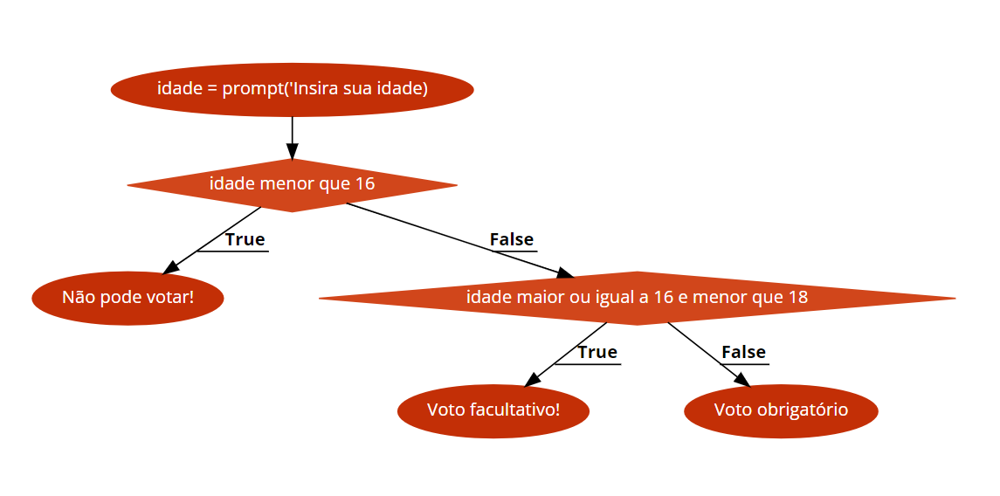

**7)** Implemente o pseudocódigo para o algoritmo representado no fluxograma da imagem.

______
### Segue a resposta:
``` 
<inicio>

idade = adicone ('insira sua idade')

se (idade < 16) {
    imprimir('Não pode votar!')
}

senão se (idade >= 16 e idade < 18 ) {
    imprimir ('Voto facultativo!')
}

senão {
    imprimir ('voto obrigatório!')
}

<fim>

```